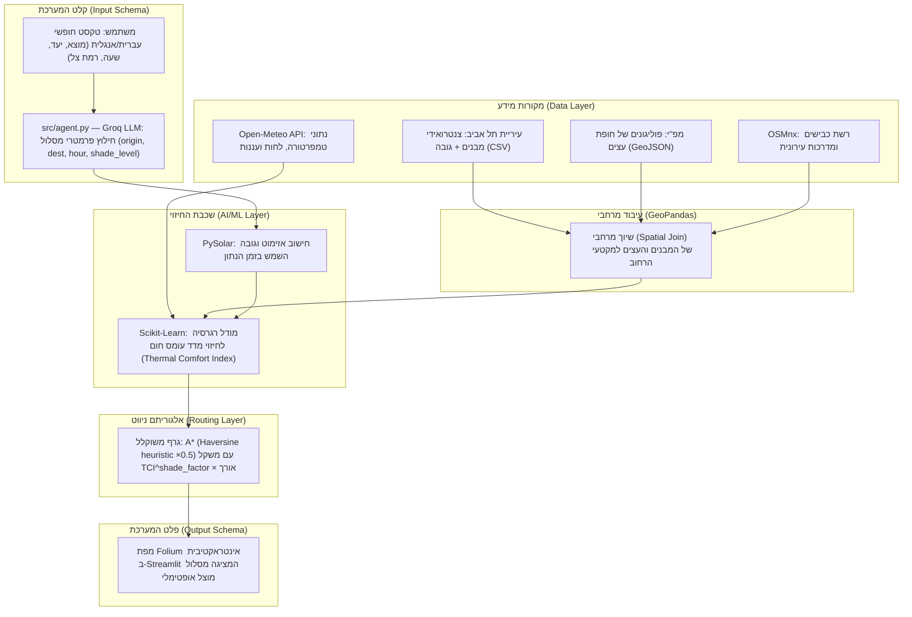

# SHADY — Thermal-Comfort Urban Routing System

🌐 **[Live App: shady-smart-navigation.streamlit.app](https://shady-smart-navigation.streamlit.app/)**
📊 **[M3 Model Validation Report (GitHub Pages)](https://technion-lbs-course.github.io/alyssa-roni/model_checks.html)**

> **One-Liner:** אופטימיזציה של תנועה עירונית להולכי רגל שמתעדפים צל באמצעות שכבות מידע גיאוגרפי ומאגרי מידע חינמיים ברשת.

---

## 1. The Problem


**אפליקציות ניווט מסחריות ממוקדות באופטימיזציה של זמן ומרחק בלבד**, תוך התעלמות מאפקט אי החום העירוני והיעדר הצללה, ההופכים רחובות למלכודות קרינה בקיץ הישראלי. עבור הולך הרגל הממוצע מדובר באי-נוחות, אך עבור אוכלוסיות רגישות ופגיעות — כגון רגישים לשמש, קשישים, ילדים והורים עם עגלות תינוק — **בחירה במסלול חשוף לשמש מהווה סכנה בריאותית מוחשית של מכות חום, עומס תרמי והתייבשות.**

למרות שנתוני תשתית קריטיים, כמו גבהי מבנים מדויקים וחופת העצים העירונית, זמינים כיום במאגרי מידע ציבוריים פתוחים (Open Data), הם נותרים מבוזרים, גולמיים ובלתי נגישים. כיום חסר פתרון טכנולוגי דינמי המבצע התכת נתונים (Data Fusion) בין שכבות ה-GIS הסטטיות לבין נתוני מזג אוויר וזווית השמש המשתנים, כדי לחשב נתיב הליכה אופטימלי המבוסס על **מדדי נוחות תרמית והצללה בזמן אמת.**

---

## 2. Vision & Goals — חזון ומטרות

**חזון:**
עיר הניתנת להליכה בכל שעה — גם בשיא הקיץ הישראלי. אנחנו מאמינות שניווט מודע-צל הוא זכות בסיסית, לא מותרות טכנולוגית.

**מטרות הפרויקט:**
1. **נגישות לאוכלוסיות פגיעות** — להעניק לקשישים, ילדים, הורים עם עגלות ואנשים עם רגישות לשמש כלי ניווט שלא קיים היום.
2. **Open Data כפתרון בריאות ציבורית** — להדגים שמאגרי נתונים ממשלתיים פתוחים (עיריית ת"א, מפ"י, OSM) מספיקים לפתרון בעיות אמיתיות — ללא סנסורים יקרים.
3. **מדע ניתן להרחבה** — לבנות ארכיטקטורה שניתן להעתיק לחיפה, ירושלים ושאר ערי ישראל עם שינוי מינימלי בנתונים.

---

## 3. Target Audience


**פרסונה (Persona) אחד מוגדר:**
נועה, בת 28, עובדת הייטק, לבקנית, שנוהגת להגיע ברכבת לתחנת השלום בתל אביב וצועדת ברגל כ-20 דקות למשרד שלה בשדרות רוטשילד. בתור בחורה צעירה שגרה במרכז, אין לה רכב והיא אוהבת לשלב הליכות בשגרת היום שלה. 

**תרחיש קונקרטי (Use Case):**
 באמצע אוגוסט בשעה 13:00, נועה צריכה לנסוע אל העבודה לאחר סידורי הבוקר שלה. כמו הרבה צעירים בתל אביב, נועה סובלת מיוקר המחייה ומעדיפה לא לעמוד בפקקים בתחבורה ציבורית במחיר מופקע אם היא יכולה ללכת ולשמור על אורח חיים בריא. ניווט רגיל ייקח אותה דרך מדרכות חשופות לחלוטין לשמש, והיא תגיע למשרד מיוזעת ותשושה. בעזרת SHADY, היא מזינה את היעד ומקבלת מסלול שאולי ארוך ב-3 דקות, אך עובר ברחובות בעלי חופת עצים עשירה ובצל המבנים, מה ששומר על בריאותה ונוחותה.


---

## 4. Data Card


פרויקט Shady מתבסס על היתוך מאגרי מידע פתוחים ברישיונות ציבוריים וממשלתיים:

**שכבת מבני עיריית ת"א (https://opendata.tel-aviv.gov.il):**
* **פורמט וגודל:** `data/buildings_clean.csv` — **45,783 צנטרואידים** (lat/lon + גובה + קומות), לא פוליגונים. קובץ הפוליגונים המקורי (`tel_aviv_buildings.geojson`, עם שדות `gova_simplex_2019`/`ms_komot`/`geometry`) אינו בפרויקט כרגע — הצללת המבנים מחושבת מ-footprint מרובע משוער סביב כל צנטרואיד (גודלו/כיוונו נגזרים מהצפיפות המקומית והרחוב הקרוב, ר' §11). הפוליגונים כן ניתנים לשחזור דרך ה-ArcGIS REST החי של העירייה (`gisn.tel-aviv.gov.il`, layer 513) — לא נרדף כרגע ביודעין.
* **רישיון:** רישיון מידע פתוח חופשי של עיריית תל-אביב-יפו.
* **שדות עיקריים (ב-`buildings_clean.csv`):** `height` (גובה מבנה במטרים), `floors`, `height_source` (recorded/imputed), `building_type`.
* **חוסרים ידועים:** ~3.66% מגבהי המבנים חסרו במקור — מנובאים ע"י נוסחת imputation (`height = 2.95*floors + 5.21`, R²≈0.49), לא ML.

**שכבת חופת עצים לאומית — מפ"י (https://data.gov.il/dataset/nationalcanopytrees):**
* **פורמט וגודל:** קובץ GeoJSON מסונן המכיל כ-231,000 פוליגונים של חופות עצים ייעודיות באזור תל אביב.
* **רישיון:** רישיון הממשלה לשימוש במידע חופשי (data.gov.il).
* **שדות עיקריים:** `geometry` (מגדיר את פוליגון חופת העץ לחישוב שטח הצללה ואידוי-דיות להורדת טמפרטורה).
* **חוסרים ידועים:** חוסר נקודתי ברמת הרחוב במקומות בהם קיימת הסתרה של צמחייה עקב בנייה רוויה בתצלומי האוויר.

**רשת רחובות — OpenStreetMap (https://osmnx.readthedocs.io/):**
* **פורמט וגודל:** אובייקט גרף מתמטי (Network Graph) המכיל את כלל צמתי ומקטעי הרחובות בתל אביב.
* **רישיון:** רישיון בסיס נתונים פתוח (ODbL).
* **שדות עיקריים:** `geometry`, `length` (אורך מקטע במטרים), ו-`highway` (סיווג סוג הדרך).

**נתוני אקלים — Open-Meteo API (https://open-meteo.com/):**
* **פורמט וגודל:** קובץ JSON דינמי המזרים נתונים אקלימיים ברזולוציה שעתית.
* **רישיון:** רישיון חופשי לשימוש לא מסחרי (CC-BY 4.0).
* **שדות עיקריים:** `temperature_2m`, `relative_humidity_2m` ו-`cloud_cover` (אחוז עננות בזמן אמת).

**הטיות אפשריות ופערים (Biases & Limitations):** המאגרים הסטטיים (עירייה ומפ"י) סובלים מהטיית פער זמנים מרחבי (Temporal Mismatch). הנתונים משקפים את המצב בשטח למועד המיפוי האחרון של הרשויות ואינם כוללים שינויים ארכיטקטוניים או בוטניים מיידיים (בניינים חדשים, מבנים שנהרסו בפינוי-בינוי, או עצים שנכרתו/נשתלו לאחרונה).

---

## 5. ML Problem Formulation

**הגדרת הבעיה:** מודל רגרסיה לחיזוי **מדד עומס החום המורגש (Thermal Comfort Index)** של מקטע רחוב.

**קלט** $X$ — וקטור של **7 מאפיינים** מרחביים ואקלימיים לכל מקטע רחוב (edge):

| קבוצה | תכונה | מקור | תיאור |
|-------|--------|------|-------|
| פיזית-מחושבת | `shadow_cov` | precompute_shadow | **כיסוי-צל מאוחד (מבנים+עצים)** ∈ [0,1] — אחוז המקטע שנמצא בצל, ממצולעי footprint אמיתיים לפי מיקום השמש. החליף את `shadow_angle` הישן, ומאז 2026-07-10 מאחד גם צל-עצים (ר' §11). |
| decoy | `building_height` | עירייה | ממוצע גובה מבנים סביב המקטע (decoy — `shadow_cov` בלע את תפקידו הפיזי) |
| decoy | `canopy_ratio` | מפ"י | אחוז כיסוי חופת עצים, סטטי (חיתוך פוליגונים אמיתי, באפר 10מ') — decoy מאז 2026-07-10, כשהצללת-עצים הדינמית עברה ל-`shadow_cov` |
| דינמית | `sun_altitude` | PySolar | גובה השמש מעל האופק ברגע הנתון |
| דינמית | `cloud_cover` | Open-Meteo | אחוז עננות |
| decoy | `temperature` | Open-Meteo | אינו בנוסחת ה-TCI — נכלל לבדיקת בחירת פיצ'רים |
| decoy | `humidity` | Open-Meteo | אינו בנוסחת ה-TCI — נכלל לבדיקת בחירת פיצ'רים |

**נוסחת ה-TCI האנליטית** (משמשת ליצירת תוויות האימון; עודכנה 2026-07-10):

$$TCI = \text{clip}\!\left(1 + 9 \cdot \frac{sa}{80} \cdot \left(1 - \frac{cloud}{100}\right) \cdot \left(1 - shadow\_cov\right),\ 1,\ 10\right)$$

`canopy_ratio` הוסר מהנוסחה (היה מודד את אותה הצללה בצורה סטטית וכפולה) — נשאר כפיצ'ר-decoy מכוון. `shadow_cov` ∈ [0,1] הוא אחוז המקטע המכוסה בצל **מבנים ועצים כאחד**, מחושב מ**מצולעי צל אמיתיים**: כל מבנה/עץ מטיל צל באורך `h/tan(sun_altitude)` בכיוון ההפוך לשמש (footprint מבנים: גודל וכיוון נגזרים מהצפיפות המקומית והרחוב הקרוב; עצים: מצולע חופה אמיתי עם גובה משוער לפי `area_class`), ובודקים איזה חלק מהמקטע נחתך עם איחוד כל הצללים. זהו שיפור מהותי על הנוסחה הישנה (`building_height × sin(shadow_angle)`) שתפסה רק זווית ולא גאומטריה — ולכן זקפה הצללת-שווא ברחובות מזרח-מערב (כשהשמש מקבילה לרחוב). ר' §11 לפירוט ההתפתחות והאימות מול Shadowmap.

**פלט** — ערך רציף סינתטי המייצג את מדד עומס החום המורגש במקטע: $y \in [1, 10]$ (מחושב עבור נתוני האימון באמצעות נוסחה תרמית אנליטית מבוססת קרינה ואינדקס חום).

**Loss function:**

$$\mathcal{L} = \text{MSE} = \frac{1}{n}\sum_{i=1}^{n}(y_i - \hat{y}_i)^2$$

**מטריקת הצלחה:** $\text{RMSE} = \sqrt{\mathcal{L}}$

> **הגדרת KPI:** המודל שלנו הוא מודל רגרסיה ונשתמש ב-RMSE כי משתנה היעד ($TCI$) הוא מספר רציף (1–10), והמדד מעניש בחומרה טעויות חיזוי גדולות (בריבוע) — מה שמבטיח בטיחות להולכי הרגל ומונע שליחתם לרחוב לוהט שנחזה בטעות כמוצל.

**ניתוח בחירת KPI — 3 שלבים:**
1. **מה הפלט?** רגרסיה — TCI הוא מספר רציף, לא קטגוריה.
2. **מה עלות הטעות?** טעות גדולה = סיכון בטיחותי לאוכלוסיות פגיעות (קשישים, לבקנים, ילדים). RMSE מעלה טעויות בריבוע ומכריח את המודל להיות שמרן.
3. **איך נראה משתנה היעד?** מתפרש על פני כל הטווח — RMSE נותן אינדיקציה אמיתית על איכות החיזוי, בניגוד למדדי סיווג שהיו מאבדים את הרזולוציה הרציפה.

**חלוקת דאטה (בפועל ב-M3):** 70% train / 15% val / 15% test (n=5000 → 3500/750/750), `random_state=42`, פיצול לפי שורה (לא לפי רחוב) — בחירת המנצח על **val**, דיווח על **test** בלבד. מתאים למקרה השימוש (ניווט ברשת ידועה), אך לא בודק הכללה לרחובות חדשים.

**Baseline:** 

ה-baseline למודל ה-ML הוא `DummyRegressor(strategy="mean")` — תמיד מנבא את ממוצע ה-TCI (RMSE≈2.35 על test). כל מודל אמיתי חייב לנצח אותו. (Linear Regression / Decision Tree / Random Forest הם **מודלים מועמדים**, לא baseline.)

**M3 — מה מומש בפועל (ושיפורים עתידיים):**

| שלב | מומש ב-M3 | שיפור עתידי |
|-----|-----------|-------------|
| חלוקת דאטה | פיצול **לפי שורה**, 70/15/15, `random_state=42` | Spatial Split (לפי מקטע) להכללה לרחובות חדשים |
| Baseline | **`DummyRegressor(mean)`** (RMSE≈2.35) — כל מודל חייב לנצח | — |
| מודלים | Linear / Decision Tree / **Random Forest** (מנצח, RMSE≈0.09) | XGBoost / LightGBM |
| Feature Engineering | 7 פיצ'רים כולל `shadow_cov` (כיסוי-צל מאוחד מבנים+עצים, מחושב מראש) | תוויות אמת + footprints אמיתיים ל-ray-casting |
| תוויות | TCI סינתטי מנוסחה אנליטית (עם `shadow_cov` מאוחד) | תוויות אמת מדודות בשטח (LST) |

---

## 6. Architecture




**תיאור זרימה:**
0. **LLM Agent (Groq / `src/agent.py`):** קלט טקסט חופשי עברית/אנגלית → `llama-3.3-70b-versatile` מחלץ פרמטרים (origin, dest, hour, mode, shade_level). Geocoding מדורג: Nominatim → Overpass API (POIs) → Photon (fuzzy, שגיאות כתיב).
1. **Frontend & UI (Streamlit & Folium):** ממשק לקליטת נתוני המשתמש והצגת הפלט הוויזואלי הסופי עם gradient צבע לפי TCI.
2. **Dynamic Environmental Data:** פנייה ל-API של Open-Meteo לשליפת מזג האוויר ואינטגרציה עם PySolar לחישוב מיקום השמש האסטרונומי.
3. **Spatial Processing Layer (GeoPandas):** הלבשת שכבות ה-GIS הסטטיות (מבני העירייה וחופת העצים של מפ"י) על גבי גרף הרחובות הטופולוגי שנשלף מ-OSMnx.
4. **Machine Learning Model (Scikit-Learn):** חישוב TCI (1–10) לכל קשת בגרף. shadow_cov נטען מ-lookup טבלה מחושבת מראש (precompute_shadow.py).
5. **Graph Routing Algorithm (NetworkX / A\*):** A* עם Haversine heuristic ×0.5 — מוצא מסלול עלות מינימלית: `TCI^shade_factor × length × street_factor`. Fallback ל-OSRM בלילה/עננות/מודל חסר.

---

## 7. User Stories

* כמשתמשת באפליקציה, אני רוצה שהמסלול המוצע ישתנה דינמית בהתאם לשעה ביום שאני בוחרת, מכיוון שזווית השמש משתנה ומיקום צל המבנים זז.
  * קריטריון קבלה: הזזת ה-Slider של השעה בממשק ה-Streamlit תפעיל מחדש את חישוב זווית השמש ב-PySolar, תעדכן את משקולות החיזוי של המודל, ותציג מסלול מעודכן על גבי המפה.

* כהורה המנווט במרחב העירוני עם עגלת תינוק (או כאדם בעל רגישות רפואית גבוהה לקרינת UV), אני רוצה לקבל בממשק חיווי ברור של אחוז ההצללה הכולל במסלול ואפשרות לבחור במצב "צל מקסימלי", כדי שאוכל למזער לחלוטין את החשיפה לשמש ישירה, גם במחיר של הארכת דרך קלה.
  * קריטריון קבלה: ממשק ה-Streamlit יציג לצד המפה מדד מספרי של אחוז ההצללה המשוער (למשל: "85% מהמסלול מוצל"), ויכלול כפתור סימון  (Toggle) שלוקח בחשבון העדפת צל קיצונית ומעדכן את משקולות הניווט בהתאם.

* כמשתמשת המבקשת לצאת לטיול רגלי או להליכה ספורטיבית בעיר בשעות אחר הצהריים, אני רוצה לראות את מפת הרחובות סביבי כשהיא צבועה בצבעים שונים לפי רמת עומס החום הנוכחית שלהם, כדי שאוכל לבחור לאן לפנות באופן עצמאי מבלי להגדיר יעד סופי קבוע מראש.
  * קריטריון קבלה: מפת ה-Folium באפליקציה תצבע את מקטעי הרחובות (Edges) בצבעים דינמיים משתנים (למשל: ירוק לעומס חום נמוך/נעים, אדום לעומס חום קיצוני/חשוף) בהתאם לציון ה-y שחוזה מודל ה-ML עבור השעה שנבחרה ב-Slider.
---

## 8. Related Work

פתרונות קיימים כוללים את אפליקציית הניווט המקומי Cool Walks Barcelona המציעה מסלולים מוצלים אך אינה שימושית בישראל, ואת פלטפורמת Shadowmap המציגה ויזואליזציית צל תלת-ממדית אינטראקטיבית בזמן אמת אך ללא אלגוריתם ניווט. בספרות האקדמית, מחקרי מיקרו-אקלים עירוני (כגון שימוש במדד הנוחות התרמית UTCI) מסתמכים לרוב על סימולציות כבדות (כמו כלי ENVI-met) שאינן ישימות לחישוב דינמי.

**השוני של Shady:** בניגוד אליהם, הפרויקט שלנו מתיך מאגרי מידע וקטוריים דו-ממדיים וקלילים (מבנים ועצים) עם מודל ML מהיר ונתוני אקלים משתנים, ומספק לראשונה פתרון בר-הרחבה (Scalable) לניווט מותאם עומס חום בזמן אמת בסביבת ייצור.

---

## 9. Risk Register

| # | סוג הסיכון | סיכון | חומרה | מיגור (Mitigation) |
| :--- | :--- | :--- | :--- | :--- |
| 1 | **טכני** | **API Downtime** — נפילה או Rate-limiting של Open-Meteo בזמן ריצת האפליקציה. | גבוהה | הגדרת Fallback קבוע בקוד: במקרה של שגיאת תקשורת, המערכת תמשוך אוטומטית נתוני אקלים ועננות ממוצעים עונתיים השמורים מקומית. |
| 2 | **נתונים** | **Spatial Mismatch** — חוסר התאמה גיאומטרי מובנה בין רשת הדרכים של OSM לשכבות ה-GIS של העירייה ומפ"י. | בינונית | ביצוע שיוך מרחבי מבוסס רדיוס השפעה (`Buffer-radius` של 5 מטרים) ב-GeoPandas, המבטיח הצלבה נכונה של המבנים והעצים לרחוב גם תחת סטיות מיפוי. |
| 3 | **לוח זמנים** | **Integration Bottleneck** — עיכוב בלוח הזמנים עקב מורכבות פיתוח מודל ה-ML במקביל לבניית ממשק הניווט הדינמי. | בינונית | עבודה במתודולוגיית MVP (מוצר מינימלי עובד): בניית גרף הניווט וממשק ה-Streamlit בשלב ראשון על בסיס נוסחה אנליטית פשוטה, ורק אז הלבשת מודל ה-ML כשיפור משלים. |

---

## 10. Installation

```bash
pip install -r requirements.txt
streamlit run app.py
```

> **LLM Agent:** נדרש `GROQ_API_KEY` בסביבה להפעלת קלט טקסט חופשי. ללא המפתח — ה-agent מחזיר הודעת שגיאה בעברית, ותובנת המסלול חוזרת למשפט מחושב; שאר האפליקציה (ניווט, מפה, EDA) עובדת כרגיל.

> **פריסה (Streamlit Cloud):** `data/tel_aviv_walk.graphml` **מועלה ל-repo** בכוונה — בלעדיו הענן מוריד גרף OSM טרי שלא תואם ל-`edges_features.parquet` ומייצר מקטעי "TCI לא זמין". `osmnx` מפונטן ל-`>=1.9,<2.0` כי osmnx 2.x שינה API ותלויות והקוד כתוב ל-1.x.

---

## 11. M3 — Trained Model (How to Run)

### בחינת המודל — דף ויזואלי

**[🔗 Model Validation Report — GitHub Pages](https://technion-lbs-course.github.io/alyssa-roni/model_checks.html)** — דף אינטראקטיבי הבוחן את המודל לפי 5 שאלות מפתח:

| # | בדיקה | תוצאה |
|---|-------|--------|
| 1 | ניצחון על baseline | ✅ שיפור ×26.3 (RMSE 2.353 → 0.090) |
| 2 | test נשמר נקי | ✅ פיצול 70/15/15 — בחירת מנצח על VAL בלבד |
| 3 | ללא data leakage | ✅ StandardScaler עטוף ב-Pipeline |
| 4 | מדד מתאים לבעיה | ✅ RMSE לרגרסיה רציפה [1, 10] (הנימוק האמיתי: זנב ההתפלגות + כיוון הטעות, לא "סימטריה=בטיחות") |
| 5 | ניתוח שגיאות | ✅ MAE=0.043 · max_error=0.662 · slices לפי פיצ'רים. **מסקנה מרכזית (M3):** השגיאות התרכזו ברחובות מבנים גבוהים → הוביל לתיקון חישוב הצל (`shadow_angle`→`shadow_cov`, ר' למטה); **המשך (2026-07-10):** איחוד צל-עצים דחק עוד יותר את הטעויות למטה |

פתיחה: [לחצו כאן](https://technion-lbs-course.github.io/alyssa-roni/model_checks.html) לצפייה בדף המעוצב.


**אימון המודל** (מתיקיית השורש של הפרויקט):
```bash
python -m src.model
```
הפקודה מאמנת baseline (`DummyRegressor`) + 3 מודלים מועמדים, מדפיסה טבלת השוואה לפי RMSE ו-R² על קבוצת ה-test, בוחרת את המנצח, ושומרת אותו ל-`data/tci_model.joblib` ואת תוצאות ההשוואה ל-`data/model_results.json`.

### תוצאות (על test, 750 שורות)

| מודל | RMSE ↓ | R² ↑ | הערה |
|------|--------|------|------|
| Baseline — `DummyRegressor(mean)` | 2.353 | ~0 | תמיד מנבא ממוצע; רצפת הביצועים |
| Linear Regression | 0.892 | 0.856 | מפספס אי-ליניאריות |
| Decision Tree | 0.160 | 0.995 | אינו יציב; נוטה ל-overfit |
| **Random Forest** 🏆 | **0.090** | **0.9985** | מנצח — פי 26.3 מהרצפה |

**Random Forest נבחר** כיוון שהוא תופס אינטראקציות לא-ליניאריות (sun × shadow_cov) שמודל לינארי מפספס, ומרסן overfit בניגוד לעץ בודד.

### חשיבות הפיצ'רים (RandomForest, אחרי איחוד צל-עצים 2026-07-10)

| פיצ'ר | חשיבות |
|--------|---------|
| `shadow_cov` | 0.764 |
| `sun_altitude` | 0.168 |
| `cloud_cover` | 0.035 |
| `temperature` (decoy) | 0.031 |
| `humidity` (decoy) | 0.003 |
| `canopy_ratio` (decoy) | 0.000 |
| `building_height` (decoy) | 0.000 |

> **`shadow_cov` עכשיו שולט (0.764, היה 0.072)** — מאז שהוא מאחד גם צל-מבנים וגם צל-עצים לאות פיזי אחד, הוא נושא כמעט את כל האינפורמציה הרלוונטית, ו-`sun_altitude` ירד בהתאם (0.747→0.168). **`canopy_ratio` ו-`building_height` צנחו ל-0.000** — decoys אמיתיים כעת, כי `shadow_cov` בלע את שני התפקידים הפיזיים שלהם. `temperature` (decoy) יורד גם הוא (0.111→0.031) — הקורלציה העונתית העקיפה נחלשת יחסית ככל ש-`shadow_cov` מסביר יותר מהשונות.

### מ-`shadow_angle` ל-`shadow_cov` — דיוק חישוב הצל (M3 → M3.5)

**הדרך לתיקון:** ניתוח השגיאות (בדיקה 5) הראה שהמודל "מפספס" בעיקר ברחובות **מבנים גבוהים**. בחינה מחודשת של השפעת המבנים חשפה שחישוב הצל היה גס: הנוסחה הישנה (`building_height × sin(shadow_angle)`) תפסה רק את הזווית בין השמש לרחוב — לא איזה צד, לא כמה רחוק המבנה, ולא אם הצל באמת חוצה את הכביש. ברחובות מזרח-מערב כשהשמש מקבילה לרחוב (בוקר/אחה"צ), היא זקפה הצללת-שווא.

**אימות ידני (במקום תוויות אמת):** אנו מודעות שה-TCI הוא נוסחה שאנו כתבנו, אז המודל "משחזר נוסחה" (R² מנופח — מעגליות). תווית אמת מדודה (LST מלוויין) תשבור זאת, אך אינה בידינו כעת. לכן ביצענו את האימות הטוב הזמין — **השוואה ל-[Shadowmap](https://app.shadowmap.org)** ברחובות שבהם צל המבנים הגבוהים משתנה תכופות לאורך היום. שינקין (רחוב מזרח-מערב) הופיע ב-Shadowmap **מואר** ב-16:00 בעוד הנוסחה הישנה הציגה אותו מוצל — והפער הזה הוביל לתיקון. (Shadowmap = כלי אימות, לא מקור נתונים: שירות סגור ולא רפרודוסבילי.)

**הפיצ'ר החדש — `shadow_cov`:** במקום לשאול "יש מבנה גבוה בכיוון השמש?", מציירים את **כתם הצל האמיתי** של כל מבנה (ריבוע footprint נגרר במרחק `h/tan(alt)` בכיוון ההפוך לשמש) ומודדים איזה אחוז מהמקטע נמצא בתוכו. הכיוון נקבע ע"י השמש → **מתקן את עצמו לפי שעה בלי סף מלאכותי**: רחוב מקביל לשמש יוצא מואר, ניצב יוצא מוצל. אימות מול Shadowmap: שינקין (E-W) 16:00 → 27% (מואר ✓), מלצ'ט (N-S) → 77% (מוצל ✓). זו הסיבה שאפשר כעת להניח שהנוסחה **קרובה יותר לאמת** — גאומטריית צל 2D אמיתית במקום פרוקסי של זווית.

**חישוב מראש (precompute) + ייחוס יום-קיץ:** החיתוך הגאומטרי (45,783 מבנים × 59,086 קשתות) כבד לזמן ריצה, לכן `precompute_shadow.py` מחשב פעם אחת (offline) כיסוי-צל לכל קשת × 27 נקודות זמן (כל חצי שעה, 6:00–19:00) → `data/shadow_coverage.parquet`, והאפליקציה/ניווט עושים lookup מיידי. **הייחוס ליום קיץ הוא הבחירה המחמירה ביותר:** בקיץ השמש הכי גבוהה → הצללים הכי קצרים → הכי פחות צל זמין → המבחן הקשה ביותר לראוטר שמחפש צל. *פערים ידועים:* (א) עונתיות השמש (חושב ליום קיץ אחד; בעונות אחרות נצמדים למצב-השמש הקרוב) — הפער בשמש, **לא** בבניינים/עצים, שהם שכבה קבועה; (ב) footprint מבנים משוער (גודל/כיוון, לא קו-מתאר אמיתי) וגובה-עץ משוער (לא מדוד). דיוק מלא ידרוש footprints אמיתיים + ray-casting.

### שיפור אלגוריתם הצל — footprint דינמי + איחוד צל-עצים (2026-07-10)

**המגבלה שהשתפרה:** עד כה כל מבנה קיבל footprint **קבוע** של 20×20מ' (בלי קשר לגודל/כיוון אמיתי), ו-`canopy_ratio` (צל-עצים) היה **סטטי** — לא תלוי-שעה בכלל, בניגוד ל-`shadow_cov` הדינמי של מבנים. שני השיפורים נעשו **בלי הורדת נתונים חדשים** — רק שימוש חכם יותר בנתונים הקיימים (הפוליגונים האמיתיים של המבנים כן ניתנים לשחזור מה-ArcGIS REST של העירייה, אך הוחלט במפורש שלא לרדוף אחריהם כרגע):

1. **footprint מבנים לפי צפיפות+כיוון:** גודל הריבוע נגזר מהצפיפות המקומית (ממוצע מרחק ל-5 שכנים קרובים, `clip[5,20]`מ') וכיוונו מיושר לרחוב הקרוב ביותר, במקום קבוע וישר-צירים.
2. **צל-עצים אוחד ל-`shadow_cov`:** מצולעי חופה אמיתיים (לא ריבוע!) נגררים לפי גובה-עץ משוער (buckets לפי `area_class`, 3–14מ'), מסוננים אדפטיבית-לשעה (רק עצים שיכולים להגיע לרחוב בזווית-השמש הנתונה), ומאוחדים לאותו STRtree עם צללי המבנים — פותר double-counting אוטומטית דרך `unary_union`.

**תוצאה מדודה:** שדרות עם canopy מתועד (רוטשילד 24.2%, ח"ן 33.6%, בן גוריון 26.1%) עברו מ-median `shadow_cov`=0.000 בצהריים ל-0.20–0.30 — הצללת-הצהריים מהעצים סוף-סוף נתפסת. `canopy_ratio`/`building_height` צנחו ל-importance=0.000 (decoys אמיתיים), `shadow_cov` עלה ל-0.764.

**אחידות:** `shadow_cov` (המאוחד) הוא כעת אות הצל **היחיד** בכל המערכת — אותו חישוב בטבלת האימון, במודל, בתצוגת גרף 4 (אנליטי + ML), ובניווט.

### צפייה בתחזית המודל באפליקציה

**📊 טאב ניתוח נתונים → גרף 4 (הכי למטה): מפת TCI על שכונת רוטשילד**

1. פתחו את האפליקציה: `streamlit run app.py`
2. עברו לטאב **📊 ניתוח נתונים**
3. גללו לתחתית הטאב — **גרף 4: מפת TCI גיאוגרפית**
4. בחרו **"מודל ML"** (ולא "נוסחה אנליטית")
5. הזיזו את **סליידר השעה** (6:00→19:00, יום קיץ) — מיקום השמש (גובה+אזימוט) מחושב ב-PySolar וה-`shadow_cov` נטען מה-lookup; הצל מתהפך לאורך היום (בוקר=מזרח, אחה"צ=מערב)
6. המפה תצבע כל מקטע רחוב לפי חיזוי המודל:
   - 🟢 ירוק = TCI ≤ 4 (מוצל, נוח)
   - 🟠 כתום = TCI 4–7 (חשיפה חלקית)
   - 🔴 אדום = TCI ≥ 7 (חשוף לשמש)

> **הערה חשובה:** אם `data/tci_model.joblib` חסר — הריצו `python -m src.model` פעם אחת לפני הפעלת האפליקציה.

#### 🚶 טאב ניווט — מסלול מוצל מונחה ML (M4)

מודל ה-RandomForest משמש בטאב **🚶 ניווט** (הטאב הראשון באפליקציה) לתכנון מסלולים מוצלים:

**קלט LLM:** ניתן להזין **טקסט חופשי** בעברית/אנגלית — לדוגמה: "אני רוצה ללכת מרוטשילד למוזיאון תל אביב בצהריים עם כמה שיותר צל" — ה-agent (Groq) מחלץ אוטומטית origin, destination, שעה ו-shade_level.

**שלבי השימוש:**
1. בחרו **"🌿 הכי מוצל (מודל ML)"** כסוג מסלול
2. בחרו **שעת יציאה** בסליידר (6:00→19:00) — השמש מחושבת לתאריך של היום בשעה זו (מזג האוויר נשאר חי)
3. בחרו **רמת צל** (קצר / מאוזן / מוצל / מקסימום) — ממופה ל-`shade_factor` שמגביר ניגודיות: `TCI^shade_factor`
4. הזינו נקודת מוצא ויעד (כתובת מדויקת, שם עסק, או שם POI — geocoding 3-שלבי)
5. המודל מחזה TCI לכל ~59,000 קשתות הגרף בקריאת `predict` אחת
6. **A\*** (Haversine heuristic ×0.5) מוצא את המסלול בעל עלות מינימלית: `TCI^shade_factor × length × street_factor`, כפוף ל**תקרת עיקוף** של ~1.6× מהמסלול הקצר (הורדת `shade_factor` הדרגתית אם צריך)
7. המסלול מוצג עם **gradient צבע** (ירוק<4, כתום 4–7, אדום>7) + ממוצע TCI
8. **תובנת מסלול (tool use):** הסוכן מציג משפט מעוגן במספרים אמיתיים — כמה דקות התארך המסלול, כמה TCI וכמה דקות חשיפה גבוהה נחסכו (ר' סעיף 12)

> **Fallback:** בלילה (sun_altitude≤0°), עננות כבדה (≥80%), או כשהמודל חסר — האפליקציה חוזרת ל-OSRM אוטומטית עם הסבר.

**העדפת רחובות ירוקים:** קשת ברחוב "ירוק" מקבלת מקדם ×0.5 במשקל הניווט, כדי שהמסלול יעדיף רחובות מוצלים גם מעבר ל-TCI הגולמי. רחוב ירוק = ממוצע כיסוי-עצים > 35%, **או** שדרה עם כיסוי ≥ 24% (רף רוטשילד — תופס בולווארדים כמו רוטשילד/ח"ן/בן גוריון שעצי הטיילת המרכזית שלהם תת-נספרים בקשתות הכביש). ה-TCI עצמו נשאר מדד נוחות נקי; זו העדפת ניווט בלבד.

ההעדפה היא **ברמת הרחוב** (לפי הממוצע), לא פר-קשת — וזה מכוון: לעיתים לרחוב ממוצע ירוק גבוה, אבל יש בו קשת בודדת עם `canopy` נמוך, וזו "שוברת" את הניווט (הראוטר מתחמק מהרחוב כולו בגללה). סימון **כל הרחוב** כירוק לפי הממוצע גורם לראוטר להעדיף אותו **כיחידה שלמה**, ולא להירתע מקשת בודדת חלשה.

> השוואה: מצב "⚡ הכי מהיר (OSRM)" מחזיר את מסלול OSRM הקלאסי ללא שיקולי צל — ניתן להשוות בין שניהם. הערה: בצהריים (שמש בזנית) ובשקיעה אין ניגודיות צל משמעותית, אז המסלול המוצל מתכנס למהיר — זו התנהגות נכונה.

### השוואה מפורטת בטאב אודות

טבלת ההשוואה המלאה + הנמקת בחירת המנצח מוצגות בתוך האפליקציה בטאב **ℹ️ אודות** → סעיף "🏆 M3 — תוצאות" (נטענות אוטומטית מ-`data/model_results.json`).

> **מהימנות:** ה-R² הגבוה (0.996) משקף שהמודל משחזר את הנוסחה האנליטית — לא מדידת נוחות תרמית אמיתית. דיוק חישוב הצל (`shadow_cov`) מקרב את הנוסחה למציאות, אך **לא שובר את המעגליות** — היעד עדיין סינתטי. המבחן האמיתי יגיע עם תוויות שטח מדודות (LST).
>
> **זו מעגליות, לא דליפת מידע (data leakage):** הפיצול 70/15/15 נקי וה-`StandardScaler` עטוף ב-Pipeline, וכל הפיצ'רים (כולל `sun_altitude`, `shadow_cov`) זמינים בזמן חיזוי. הבעיה אינה שמידע מה-test דולף לאימון, אלא שה-**תווית** נגזרת אנליטית מאותם פיצ'רים — ולכן המודל לומד לשחזר נוסחה. נפתר רק עם תווית נמדדת, לא עם תיקון מתודולוגי.

---

## 12. M4 — שיפורי ביצועים ונגישות למשתמש (מומש)

בהמשך לפיתוח MVP של M3, M4 הוסיף את השיפורים הבאים:

### LLM Agent — קלט טקסט חופשי (src/agent.py)

הטאב ניווט תומך כעת בקלט טקסט חופשי בעברית/אנגלית:
- **מודל:** Groq API — llama-3.3-70b-versatile
- **תפקיד:** חילוץ פרמטרים בלבד — origin, destination, hour, date, mode, shade_level, recommendation (100 תווים)
- **Hebrew normalization:** קידומות דקדוקיות (מ/ל/ב/ה) מנוקות משמות מקומות לפני geocoding
- **לוגיקת מזג-אוויר:** בלילה/עננות כבדה — ה-agent ממליץ אוטומטית על מסלול מהיר עם הסבר
- **Fallback:** כל כשלון (auth, network, JSON parse) → הודעת שגיאה ידידותית בעברית
- **תלות:** GROQ_API_KEY בסביבה (אופציונלי — שאר האפליקציה עובדת ללא המפתח)

### Geocoding מדורג ב-3 שלבים

במקום Nominatim בלבד:
0. **תיקון שגיאת-כתיב בשם רחוב** — כשיש מספר בית, שם הרחוב מתוקן מול מילון שמות הרחובות של גרף ה-OSM (`difflib`, סף גבוה) כדי ש"דיזינגוף 55" (עם י' מיותרת) לא יוביל לכתובת שגויה. שמות POI (בלי מספר) לא נוגעים.
1. **Nominatim** — 3 וריאנטי שאילתה
2. **Overpass API** — שמות POI ללא כתובת מדויקת (מסעדות, קפה, פארקים)
3. **Photon** — fuzzy geocoder שסובל שגיאות כתיב וחיפוש לפי שם עסק

### shade_level — שליטה על עוצמת העדפת הצל

**3 רמות** (עודכן מ-4 ל-3 ב-2026-07-09):

| רמה | shade_factor | אפקט |
|-----|-------------|-------|
| short | 1.0 | מסלול קצר; צל שיקול משני |
| balanced | 2.0 | שיקול שווה (ברירת מחדל) |
| max | 3.0 | מקסימום צל; מוכנות לעקיפה ניכרת |

משקל הקשת = TCI^shade_factor x length x street_factor

### תובנת מסלול — M4 tool use (הסוכן מסביר את התועלת)

אחרי חישוב מסלול מוצל, הסוכן מציג משפט תובנה מעוגן (לדוגמה: *"🌿 המסלול המוצל האריך את ההליכה ב-4 דק', הוריד את ה-TCI הממוצע ב-1.6, חסך כ-6 דק' של חשיפה גבוהה לשמש"*). זהו מימוש **tool use / function-calling** אמיתי של M4:

1. **Turn 1 (input):** ה-LLM מחליט לקרוא לכלי `evaluate_route`.
2. **הקוד רץ:** `compute_length_route` (מסלול-בסיס קצר על הגרף, עם TCI פר-מקטע) + `compute_route_insights` מחשבים את המספרים האמיתיים — התארכות (דק'), חיסכון TCI ממוצע, ודקות "חשיפה גבוהה" (מקטעים עם TCI>5.5) שנחסכו. **המודל/הראוטינג של הצוות רצים כאן — לא ה-LLM.**
3. **Turn 2 (prescriptive):** ה-LLM מקבל את המספרים ומנסח משפט עברית **מעוגן בהם בלבד** — לעולם לא ממציא מספר.

**Fallback:** אם Groq לא זמין / אין מפתח → מוצג משפט מחושב בקוד (`format_insight_fallback`) עם אותם מספרים. הפיצ'ר אף פעם לא שובר ועובד גם מקומית ללא מפתח.

### כלל לילה דטרמיניסטי + זיהוי תאריכים

- **כלל לילה מוחלט:** שעה מחוץ לטווח היום (6–19) או שמש מתחת לאופק כופה מסלול מהיר (`mode=fast`), **גובר על כל בקשת צל מפורשת** בטקסט ("ב-5 בבוקר בדרך הכי מוצלת" → עדיין מהיר). נאכף דטרמיניסטית ב-`_validate`, לא רק בהנחיית פרומפט.
- **תאריכים עבריים:** ה-agent מקבל טבלת-תאריכים מוזרקת (15 ימים קדימה: תאריך + שם-יום עברי + סימון "השבוע"/"שבוע הבא", שבוע ישראלי מתחיל ביום ראשון) ו**בוחר** מהטבלה במקום לחשב — כך "ביום שני בשבוע הבא" נפתר נכון (LLMs לא אמינים בחשבון תאריכים).

### שיפורים נוספים

- **A\* במקום Dijkstra:** Haversine heuristic x0.5 (admissible) — מהיר יותר עם אחריות אופטימליות
- **תקרת עיקוף (`DETOUR_CAP=1.6`):** המסלול המוצל לא יעלה על ~1.6× אורך המסלול הקצר — `plan_route` מוריד את `shade_factor` בהדרגה עד שהמסלול עומד בתקרה, כדי למנוע פיתולים קיצוניים ששיפור הנוחות בהם זניח
- **Pedestrian bonus:** footways/pedestrian paths — משקל x0.8
- **TCI color gradient על המסלול:** ירוק<4, כתום 4-7, אדום>7
- **Fallback modes:** model_missing / night / overcast / weights_missing → OSRM אוטומטי

### עתידי (לא מומש עדיין)

- **שעת יציאה עתידית עד 48 שעות** — Open-Meteo forecast API (כעת: מזג אוויר חי, שמש לשעה הנבחרת)
- **footprints אמיתיים + ray-casting** — במקום footprint משוער (גודל/כיוון מהצפיפות/רחוב, לא קו-מתאר אמיתי); הפוליגונים זמינים ב-ArcGIS REST של העירייה, לא נרדפו כרגע
- **תוויות LST אמיתיות** מלוויין (Earth Engine) — שוברות את המעגליות של היעד הסינתטי

---
***SHADY - Stay Cool ;)***


*Alisa & Rony — LBS Course 160833, Technion*
