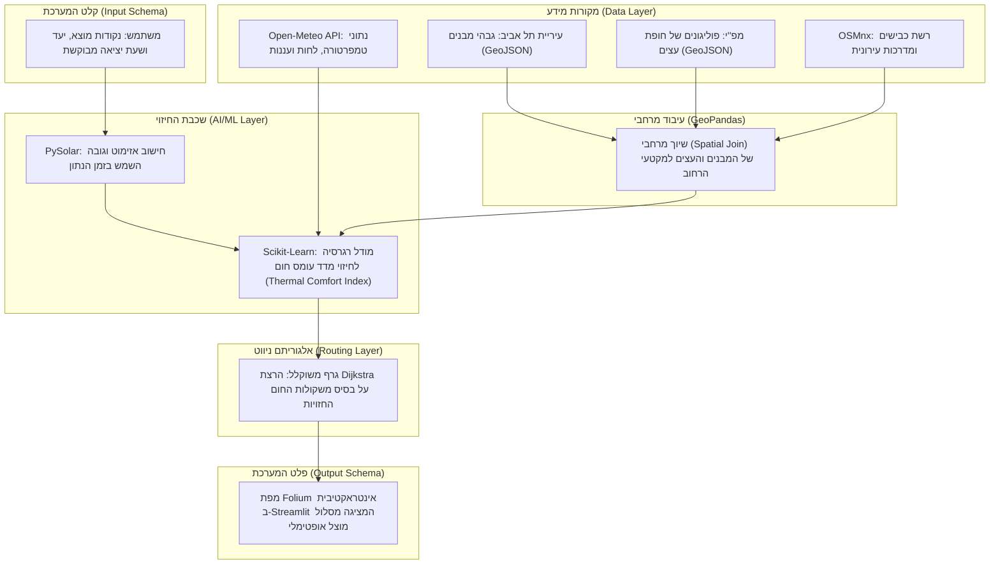

# SHADY — Thermal-Comfort Urban Routing System

> **One-Liner:** אופטימיזציה של תנועה עירונית להולכי רגל שמתעדפים צל באמצעות שכבות מידע גיאוגרפי ומאגרי מידע חינמיים ברשת.

---

## 1. The Problem


**אפליקציות ניווט מסחריות ממוקדות באופטימיזציה של זמן ומרחק בלבד**, תוך התעלמות מאפקט אי החום העירוני והיעדר הצללה, ההופכים רחובות למלכודות קרינה בקיץ הישראלי. עבור הולך הרגל הממוצע מדובר באי-נוחות, אך עבור אוכלוסיות רגישות ופגיעות — כגון רגישים לשמש, קשישים, ילדים והורים עם עגלות תינוק — **בחירה במסלול חשוף לשמש מהווה סכנה בריאותית מוחשית של מכות חום, עומס תרמי והתייבשות.**

למרות שנתוני תשתית קריטיים, כמו גבהי מבנים מדויקים וחופת העצים העירונית, זמינים כיום במאגרי מידע ציבוריים פתוחים (Open Data), הם נותרים מבוזרים, גולמיים ובלתי נגישים. כיום חסר פתרון טכנולוגי דינמי המבצע התכת נתונים (Data Fusion) בין שכבות ה-GIS הסטטיות לבין נתוני מזג אוויר וזווית השמש המשתנים, כדי לחשב נתיב הליכה אופטימלי המבוסס על **מדדי נוחות תרמית והצללה בזמן אמת.**

---

## 2. Vision & Goals — חזון ומטרות

**חזון:**
עיר הניתנת להליכה בכל שעה — גם בשיא הקיץ הישראלי. אנחנו מאמינות שניווט מודע-צל הוא זכות בסיסית, לא מותרות טכנולוגית.

**מטרות הפרויקט:**
1. **נגישות לאוכלוסיות פגיעות** — להעניק לקשישים, ילדים, הורים עם עגלות ואנשים עם רגישות לשמש כלי ניווט שלא קיים היום.
2. **Open Data כפתרון בריאות ציבורית** — להדגים שמאגרי נתונים ממשלתיים פתוחים (עיריית ת"א, מפ"י, OSM) מספיקים לפתרון בעיות אמיתיות — ללא סנסורים יקרים.
3. **מדע ניתן להרחבה** — לבנות ארכיטקטורה שניתן להעתיק לחיפה, ירושלים ושאר ערי ישראל עם שינוי מינימלי בנתונים.

---

## 3. Target Audience


**פרסונה (Persona) אחד מוגדר:**
נועה, בת 28, עובדת הייטק, לבקנית, שנוהגת להגיע ברכבת לתחנת השלום בתל אביב וצועדת ברגל כ-20 דקות למשרד שלה בשדרות רוטשילד. בתור בחורה צעירה שגרה במרכז, אין לה רכב והיא אוהבת לשלב הליכות בשגרת היום שלה. 

**תרחיש קונקרטי (Use Case):**
 באמצע אוגוסט בשעה 13:00, נועה צריכה לנסוע אל העבודה לאחר סידורי הבוקר שלה. כמו הרבה צעירים בתל אביב, נועה סובלת מיוקר המחייה ומעדיפה לא לעמוד בפקקים בתחבורה ציבורית במחיר מופקע אם היא יכולה ללכת ולשמור על אורח חיים בריא. ניווט רגיל ייקח אותה דרך מדרכות חשופות לחלוטין לשמש, והיא תגיע למשרד מיוזעת ותשושה. בעזרת SHADY, היא מזינה את היעד ומקבלת מסלול שאולי ארוך ב-3 דקות, אך עובר ברחובות בעלי חופת עצים עשירה ובצל המבנים, מה ששומר על בריאותה ונוחותה.


---

## 4. Data Card


פרויקט Shady מתבסס על היתוך מאגרי מידע פתוחים ברישיונות ציבוריים וממשלתיים:

**שכבת מבני עיריית ת"א (https://opendata.tel-aviv.gov.il):** 
* **פורמט וגודל:** קובץ GeoJSON המכיל כ-45,900 ישויות וקטוריות (פוליגונים).
* **רישיון:** רישיון מידע פתוח חופשי של עיריית תל-אביב-יפו.
* **שדות עיקריים:** `gova_simplex_2019` (גובה מבנה נטו במטרים), `ms_komot` (מספר קומות) ו-`geometry`.
* **חוסרים ידועים:** ערכי NaN (מידע חסר) עבור כ-4% מגבהי המבנים. חוסר זה מטופל ומנובא אקטיבית כבר עכשיו על ידי מודל ה-Machine Learning (על בסיס שטח המבנה והסנטרואיד שלו), ללא כל הסתמכות על איסוף נתונים עתידי.

**שכבת חופת עצים לאומית — מפ"י (https://data.gov.il/dataset/nationalcanopytrees):**
* **פורמט וגודל:** קובץ GeoJSON מסונן המכיל כ-231,000 פוליגונים של חופות עצים ייעודיות באזור תל אביב.
* **רישיון:** רישיון הממשלה לשימוש במידע חופשי (data.gov.il).
* **שדות עיקריים:** `geometry` (מגדיר את פוליגון חופת העץ לחישוב שטח הצללה ואידוי-דיות להורדת טמפרטורה).
* **חוסרים ידועים:** חוסר נקודתי ברמת הרחוב במקומות בהם קיימת הסתרה של צמחייה עקב בנייה רוויה בתצלומי האוויר.

**רשת רחובות — OpenStreetMap (https://osmnx.readthedocs.io/):**
* **פורמט וגודל:** אובייקט גרף מתמטי (Network Graph) המכיל את כלל צמתי ומקטעי הרחובות בתל אביב.
* **רישיון:** רישיון בסיס נתונים פתוח (ODbL).
* **שדות עיקריים:** `geometry`, `length` (אורך מקטע במטרים), ו-`highway` (סיווג סוג הדרך).

**נתוני אקלים — Open-Meteo API (https://open-meteo.com/):**
* **פורמט וגודל:** קובץ JSON דינמי המזרים נתונים אקלימיים ברזולוציה שעתית.
* **רישיון:** רישיון חופשי לשימוש לא מסחרי (CC-BY 4.0).
* **שדות עיקריים:** `temperature_2m`, `relative_humidity_2m` ו-`cloud_cover` (אחוז עננות בזמן אמת).

**הטיות אפשריות ופערים (Biases & Limitations):** המאגרים הסטטיים (עירייה ומפ"י) סובלים מהטיית פער זמנים מרחבי (Temporal Mismatch). הנתונים משקפים את המצב בשטח למועד המיפוי האחרון של הרשויות ואינם כוללים שינויים ארכיטקטוניים או בוטניים מיידיים (בניינים חדשים, מבנים שנהרסו בפינוי-בינוי, או עצים שנכרתו/נשתלו לאחרונה).

---

## 5. ML Problem Formulation

**הגדרת הבעיה:** מודל רגרסיה לחיזוי **מדד עומס החום המורגש (Thermal Comfort Index)** של מקטע רחוב.

**קלט** $X$ — וקטור של **7 מאפיינים** מרחביים ואקלימיים לכל מקטע רחוב (edge):

| קבוצה | תכונה | מקור | תיאור |
|-------|--------|------|-------|
| פיזית-מחושבת | `shadow_cov` | precompute_shadow | **כיסוי-צל מבנים** ∈ [0,1] — אחוז המקטע שנמצא בצל מבנים, ממצולעי footprint לפי מיקום השמש. החליף את `shadow_angle` הישן. |
| פיזית-סטטית | `building_height` | עירייה | ממוצע גובה מבנים סביב המקטע (כיום פיצ'ר עזר — תפקידו נבלע ע"י `shadow_cov`) |
| פיזית-סטטית | `canopy_ratio` | מפ"י | אחוז כיסוי חופת עצים (חיתוך פוליגונים אמיתי, באפר 10מ') |
| דינמית | `sun_altitude` | PySolar | גובה השמש מעל האופק ברגע הנתון |
| דינמית | `cloud_cover` | Open-Meteo | אחוז עננות |
| decoy | `temperature` | Open-Meteo | אינו בנוסחת ה-TCI — נכלל לבדיקת בחירת פיצ'רים |
| decoy | `humidity` | Open-Meteo | אינו בנוסחת ה-TCI — נכלל לבדיקת בחירת פיצ'רים |

**נוסחת ה-TCI האנליטית** (משמשת ליצירת תוויות האימון):

$$TCI = \text{clip}\!\left(1 + 9 \cdot \frac{sa}{80} \cdot \left(1 - \frac{cloud}{100}\right) \cdot \left(1 - 0.6 \cdot canopy - 0.4 \cdot shadow\_cov\right),\ 1,\ 10\right)$$

כאשר `shadow_cov` ∈ [0,1] הוא אחוז המקטע המכוסה בצל מבנים, מחושב מ**מצולעי צל אמיתיים**: כל מבנה (ריבוע footprint בגובהו) מטיל צל באורך `h/tan(sun_altitude)` בכיוון ההפוך לשמש, ובודקים איזה חלק מהמקטע נחתך עם איחוד הצללים. זהו שיפור מהותי על הנוסחה הישנה (`building_height × sin(shadow_angle)`) שתפסה רק זווית ולא גאומטריה — ולכן זקפה הצללת-שווא ברחובות מזרח-מערב (כשהשמש מקבילה לרחוב). ר' §11 לפירוט ההתפתחות והאימות מול Shadowmap.

**פלט** — ערך רציף סינתטי המייצג את מדד עומס החום המורגש במקטע: $y \in [1, 10]$ (מחושב עבור נתוני האימון באמצעות נוסחה תרמית אנליטית מבוססת קרינה ואינדקס חום).

**Loss function:**

$$\mathcal{L} = \text{MSE} = \frac{1}{n}\sum_{i=1}^{n}(y_i - \hat{y}_i)^2$$

**מטריקת הצלחה:** $\text{RMSE} = \sqrt{\mathcal{L}}$

> **הגדרת KPI:** המודל שלנו הוא מודל רגרסיה ונשתמש ב-RMSE כי משתנה היעד ($TCI$) הוא מספר רציף (1–10), והמדד מעניש בחומרה טעויות חיזוי גדולות (בריבוע) — מה שמבטיח בטיחות להולכי הרגל ומונע שליחתם לרחוב לוהט שנחזה בטעות כמוצל.

**ניתוח בחירת KPI — 3 שלבים:**
1. **מה הפלט?** רגרסיה — TCI הוא מספר רציף, לא קטגוריה.
2. **מה עלות הטעות?** טעות גדולה = סיכון בטיחותי לאוכלוסיות פגיעות (קשישים, לבקנים, ילדים). RMSE מעלה טעויות בריבוע ומכריח את המודל להיות שמרן.
3. **איך נראה משתנה היעד?** מתפרש על פני כל הטווח — RMSE נותן אינדיקציה אמיתית על איכות החיזוי, בניגוד למדדי סיווג שהיו מאבדים את הרזולוציה הרציפה.

**חלוקת דאטה (בפועל ב-M3):** 70% train / 15% val / 15% test (n=5000 → 3500/750/750), `random_state=42`, פיצול לפי שורה (לא לפי רחוב) — בחירת המנצח על **val**, דיווח על **test** בלבד. מתאים למקרה השימוש (ניווט ברשת ידועה), אך לא בודק הכללה לרחובות חדשים.

**Baseline:** 

ה-baseline למודל ה-ML הוא `DummyRegressor(strategy="mean")` — תמיד מנבא את ממוצע ה-TCI (RMSE≈2.14 על test). כל מודל אמיתי חייב לנצח אותו. (Linear Regression / Decision Tree / Random Forest הם **מודלים מועמדים**, לא baseline.) יעילות הניווט הכללית תושווה בנפרד מול אלגוריתם $\text{Dijkstra}$ גיאומטרי.

**M3 — מה מומש בפועל (ושיפורים עתידיים):**

| שלב | מומש ב-M3 | שיפור עתידי |
|-----|-----------|-------------|
| חלוקת דאטה | פיצול **לפי שורה**, 70/15/15, `random_state=42` | Spatial Split (לפי מקטע) להכללה לרחובות חדשים |
| Baseline | **`DummyRegressor(mean)`** (RMSE≈2.14) — כל מודל חייב לנצח | — |
| מודלים | Linear / Decision Tree / **Random Forest** (מנצח, RMSE≈0.14) | XGBoost / LightGBM |
| Feature Engineering | 7 פיצ'רים כולל `shadow_cov` (כיסוי-צל ממצולעי footprint, מחושב מראש) | תוויות אמת + footprints אמיתיים ל-ray-casting |
| תוויות | TCI סינתטי מנוסחה אנליטית (עם `shadow_cov`) | תוויות אמת מדודות בשטח (LST) |

---

## 6. Architecture




**תיאור זרימה:**
1. **Frontend & UI (Streamlit & Folium):** ממשק לקליטת נתוני המשתמש (זמן ומרחב) והצגת הפלט הוויזואלי הסופי.
2. **Dynamic Environmental Data:**  פנייה ל-API של Open-Meteo לשליפת מזג האוויר ואינטגרציה עם PySolar לחישוב מיקום השמש האסטרונומי.
3. **Spatial Processing Layer (GeoPandas):**  הלבשת שכבות ה-GIS הסטטיות (מבני העירייה וחופת העצים של מפ"י) על גבי גרף הרחובות הטופולוגי שנשלף מ-OSMnx.
4. **Machine Learning Model (Scikit-Learn):** חישוב משקולת עומס חום מורגש (בין 1 ל-10) לכל קשת בגרף על בסיס הפיצ'רים הדינמיים והסטטיים.
5. **Graph Routing Algorithm (NetworkX / Dijkstra):**  מציאת המסלול בעל העלות התרמית הנמוכה ביותר והזרקתו חזרה למפת ה-Frontend.

---

## 7. User Stories

* כמשתמשת באפליקציה, אני רוצה שהמסלול המוצע ישתנה דינמית בהתאם לשעה ביום שאני בוחרת, מכיוון שזווית השמש משתנה ומיקום צל המבנים זז.
  * קריטריון קבלה: הזזת ה-Slider של השעה בממשק ה-Streamlit תפעיל מחדש את חישוב זווית השמש ב-PySolar, תעדכן את משקולות החיזוי של המודל, ותציג מסלול מעודכן על גבי המפה.

* כהורה המנווט במרחב העירוני עם עגלת תינוק (או כאדם בעל רגישות רפואית גבוהה לקרינת UV), אני רוצה לקבל בממשק חיווי ברור של אחוז ההצללה הכולל במסלול ואפשרות לבחור במצב "צל מקסימלי", כדי שאוכל למזער לחלוטין את החשיפה לשמש ישירה, גם במחיר של הארכת דרך קלה.
  * קריטריון קבלה: ממשק ה-Streamlit יציג לצד המפה מדד מספרי של אחוז ההצללה המשוער (למשל: "85% מהמסלול מוצל"), ויכלול כפתור סימון  (Toggle) שלוקח בחשבון העדפת צל קיצונית ומעדכן את משקולות הניווט בהתאם.

* כמשתמשת המבקשת לצאת לטיול רגלי או להליכה ספורטיבית בעיר בשעות אחר הצהריים, אני רוצה לראות את מפת הרחובות סביבי כשהיא צבועה בצבעים שונים לפי רמת עומס החום הנוכחית שלהם, כדי שאוכל לבחור לאן לפנות באופן עצמאי מבלי להגדיר יעד סופי קבוע מראש.
  * קריטריון קבלה: מפת ה-Folium באפליקציה תצבע את מקטעי הרחובות (Edges) בצבעים דינמיים משתנים (למשל: ירוק לעומס חום נמוך/נעים, אדום לעומס חום קיצוני/חשוף) בהתאם לציון ה-y שחוזה מודל ה-ML עבור השעה שנבחרה ב-Slider.
---

## 8. Related Work

פתרונות קיימים כוללים את אפליקציית הניווט המקומי Cool Walks Barcelona המציעה מסלולים מוצלים אך אינה שימושית בישראל, ואת פלטפורמת Shadowmap המציגה ויזואליזציית צל תלת-ממדית אינטראקטיבית בזמן אמת אך ללא אלגוריתם ניווט. בספרות האקדמית, מחקרי מיקרו-אקלים עירוני (כגון שימוש במדד הנוחות התרמית UTCI) מסתמכים לרוב על סימולציות כבדות (כמו כלי ENVI-met) שאינן ישימות לחישוב דינמי.

**השוני של Shady:** בניגוד אליהם, הפרויקט שלנו מתיך מאגרי מידע וקטוריים דו-ממדיים וקלילים (מבנים ועצים) עם מודל ML מהיר ונתוני אקלים משתנים, ומספק לראשונה פתרון בר-הרחבה (Scalable) לניווט מותאם עומס חום בזמן אמת בסביבת ייצור.

---

## 9. Risk Register

| # | סוג הסיכון | סיכון | חומרה | מיגור (Mitigation) |
| :--- | :--- | :--- | :--- | :--- |
| 1 | **טכני** | **API Downtime** — נפילה או Rate-limiting של Open-Meteo בזמן ריצת האפליקציה. | גבוהה | הגדרת Fallback קבוע בקוד: במקרה של שגיאת תקשורת, המערכת תמשוך אוטומטית נתוני אקלים ועננות ממוצעים עונתיים השמורים מקומית. |
| 2 | **נתונים** | **Spatial Mismatch** — חוסר התאמה גיאומטרי מובנה בין רשת הדרכים של OSM לשכבות ה-GIS של העירייה ומפ"י. | בינונית | ביצוע שיוך מרחבי מבוסס רדיוס השפעה (`Buffer-radius` של 5 מטרים) ב-GeoPandas, המבטיח הצלבה נכונה של המבנים והעצים לרחוב גם תחת סטיות מיפוי. |
| 3 | **לוח זמנים** | **Integration Bottleneck** — עיכוב בלוח הזמנים עקב מורכבות פיתוח מודל ה-ML במקביל לבניית ממשק הניווט הדינמי. | בינונית | עבודה במתודולוגיית MVP (מוצר מינימלי עובד): בניית גרף הניווט וממשק ה-Streamlit בשלב ראשון על בסיס נוסחה אנליטית פשוטה, ורק אז הלבשת מודל ה-ML כשיפור משלים. |

---

## 10. Installation

```bash
pip install -r requirements.txt
streamlit run app.py
```

---

## 11. M3 — Trained Model (How to Run)

### בחינת המודל — דף ויזואלי

**[`outputs_M3/model_checks.html`](outputs_M3/model_checks.html)** — דף אינטראקטיבי הבוחן את המודל לפי 5 שאלות מפתח:

| # | בדיקה | תוצאה |
|---|-------|--------|
| 1 | ניצחון על baseline | ✅ שיפור ×15.7 (RMSE 2.137 → 0.136) |
| 2 | test נשמר נקי | ✅ פיצול 70/15/15 — בחירת מנצח על VAL בלבד |
| 3 | ללא data leakage | ✅ StandardScaler עטוף ב-Pipeline |
| 4 | מדד מתאים לבעיה | ✅ RMSE לרגרסיה רציפה [1, 10] (הנימוק האמיתי: זנב ההתפלגות + כיוון הטעות, לא "סימטריה=בטיחות") |
| 5 | ניתוח שגיאות | ✅ MAE=0.079 · max_error=1.591 · slices לפי פיצ'רים. **מסקנה מרכזית:** השגיאות התרכזו ברחובות מבנים גבוהים → הוביל לתיקון חישוב הצל (ר' למטה) |

פתיחה: לחצו פעמיים על הקובץ בסייר הקבצים, או דרך VS Code → Right Click → Open with Live Server.


**אימון המודל** (מתיקיית השורש של הפרויקט):
```bash
python -m src.model
```
הפקודה מאמנת baseline (`DummyRegressor`) + 3 מודלים מועמדים, מדפיסה טבלת השוואה לפי RMSE ו-R² על קבוצת ה-test, בוחרת את המנצח, ושומרת אותו ל-`data/tci_model.joblib` ואת תוצאות ההשוואה ל-`data/model_results.json`.

### תוצאות (על test, 750 שורות)

| מודל | RMSE ↓ | R² ↑ | הערה |
|------|--------|------|------|
| Baseline — `DummyRegressor(mean)` | 2.137 | ~0 | תמיד מנבא ממוצע; רצפת הביצועים |
| Linear Regression | 0.572 | 0.928 | מפספס אי-ליניאריות |
| Decision Tree | 0.218 | 0.990 | אינו יציב; נוטה ל-overfit |
| **Random Forest** 🏆 | **0.136** | **0.996** | מנצח — פי 15.7 מהרצפה |

**Random Forest נבחר** כיוון שהוא תופס אינטראקציות לא-ליניאריות (sun × canopy × shadow_cov) שמודל לינארי מפספס, ומרסן overfit בניגוד לעץ בודד.

### חשיבות הפיצ'רים (RandomForest)

| פיצ'ר | חשיבות |
|--------|---------|
| `sun_altitude` | 0.747 |
| `temperature` (decoy) | 0.111 |
| `shadow_cov` | 0.072 |
| `canopy_ratio` | 0.034 |
| `cloud_cover` | 0.029 |
| `humidity` (decoy) | 0.006 |
| `building_height` | 0.001 |

> `sun_altitude` שולט כי הנוסחה תלויה בו כמעט ריבועית. **`shadow_cov` (0.072) קפץ מ-`shadow_angle` הישן (0.004)** — אות צל חזק יותר; ו-`building_height` צנח ל-0.001 כי `shadow_cov` בלע את תפקידו. `temperature` (decoy, 0.111) עולה בגלל קורלציה עונתית עקיפה עם `sun_altitude` — לא קשר סיבתי, צפוי להיחלש בנתוני אמת.

### מ-`shadow_angle` ל-`shadow_cov` — דיוק חישוב הצל (M3 → M3.5)

**הדרך לתיקון:** ניתוח השגיאות (בדיקה 5) הראה שהמודל "מפספס" בעיקר ברחובות **מבנים גבוהים**. בחינה מחודשת של השפעת המבנים חשפה שחישוב הצל היה גס: הנוסחה הישנה (`building_height × sin(shadow_angle)`) תפסה רק את הזווית בין השמש לרחוב — לא איזה צד, לא כמה רחוק המבנה, ולא אם הצל באמת חוצה את הכביש. ברחובות מזרח-מערב כשהשמש מקבילה לרחוב (בוקר/אחה"צ), היא זקפה הצללת-שווא.

**אימות ידני (במקום תוויות אמת):** אנו מודעות שה-TCI הוא נוסחה שאנו כתבנו, אז המודל "משחזר נוסחה" (R² מנופח — מעגליות). תווית אמת מדודה (LST מלוויין) תשבור זאת, אך אינה בידינו כעת. לכן ביצענו את האימות הטוב הזמין — **השוואה ל-[Shadowmap](https://app.shadowmap.org)** ברחובות שבהם צל המבנים הגבוהים משתנה תכופות לאורך היום. שינקין (רחוב מזרח-מערב) הופיע ב-Shadowmap **מואר** ב-16:00 בעוד הנוסחה הישנה הציגה אותו מוצל — והפער הזה הוביל לתיקון. (Shadowmap = כלי אימות, לא מקור נתונים: שירות סגור ולא רפרודוסבילי.)

**הפיצ'ר החדש — `shadow_cov`:** במקום לשאול "יש מבנה גבוה בכיוון השמש?", מציירים את **כתם הצל האמיתי** של כל מבנה (ריבוע footprint נגרר במרחק `h/tan(alt)` בכיוון ההפוך לשמש) ומודדים איזה אחוז מהמקטע נמצא בתוכו. הכיוון נקבע ע"י השמש → **מתקן את עצמו לפי שעה בלי סף מלאכותי**: רחוב מקביל לשמש יוצא מואר, ניצב יוצא מוצל. אימות מול Shadowmap: שינקין (E-W) 16:00 → 27% (מואר ✓), מלצ'ט (N-S) → 77% (מוצל ✓). זו הסיבה שאפשר כעת להניח שהנוסחה **קרובה יותר לאמת** — גאומטריית צל 2D אמיתית במקום פרוקסי של זווית.

**חישוב מראש (precompute) + ייחוס יום-קיץ:** החיתוך הגאומטרי (45,783 מבנים × 59,086 קשתות) כבד לזמן ריצה, לכן `precompute_shadow.py` מחשב פעם אחת (offline) כיסוי-צל לכל קשת × 27 שעות (6:00–19:00) → `data/shadow_coverage.parquet`, והאפליקציה/ניווט עושים lookup מיידי. **הייחוס ליום קיץ הוא הבחירה המחמירה ביותר:** בקיץ השמש הכי גבוהה → הצללים הכי קצרים → הכי פחות צל זמין → המבחן הקשה ביותר לראוטר שמחפש צל. *פערים ידועים:* (א) עונתיות השמש (חושב ליום קיץ אחד; בעונות אחרות נצמדים למצב-השמש הקרוב) — הפער בשמש, **לא** בבניינים, שהם שכבה קבועה; (ב) ייצוג המבנה כריבוע 20מ' מצנטרואיד ולא קו-מתאר אמיתי. דיוק מלא ידרוש footprints + ray-casting (M4).

**אחידות:** `shadow_cov` הוא כעת אות הצל **היחיד** בכל המערכת — אותו חישוב בטבלת האימון, במודל, בתצוגת גרף 4 (אנליטי + ML), ובניווט.

### צפייה בתחזית המודל באפליקציה

**📊 טאב ניתוח נתונים → גרף 4 (הכי למטה): מפת TCI על שכונת רוטשילד**

1. פתחו את האפליקציה: `streamlit run app.py`
2. עברו לטאב **📊 ניתוח נתונים**
3. גללו לתחתית הטאב — **גרף 4: מפת TCI גיאוגרפית**
4. בחרו **"מודל ML"** (ולא "נוסחה אנליטית")
5. הזיזו את **סליידר השעה** (6:00→19:00, יום קיץ) — מיקום השמש (גובה+אזימוט) מחושב ב-PySolar וה-`shadow_cov` נטען מה-lookup; הצל מתהפך לאורך היום (בוקר=מזרח, אחה"צ=מערב)
6. המפה תצבע כל מקטע רחוב לפי חיזוי המודל:
   - 🟢 ירוק = TCI ≤ 4 (מוצל, נוח)
   - 🟠 כתום = TCI 4–7 (חשיפה חלקית)
   - 🔴 אדום = TCI ≥ 7 (חשוף לשמש)

> **הערה חשובה:** אם `data/tci_model.joblib` חסר — הריצו `python -m src.model` פעם אחת לפני הפעלת האפליקציה.

#### 🚶 טאב ניווט — מסלול מוצל מונחה ML

מודל ה-RandomForest משמש גם בטאב **🚶 ניווט** לתכנון מסלולים מוצלים:

1. בחרו **"🌿 הכי מוצל (מודל ML)"** כסוג מסלול
2. בחרו **שעת יציאה** בסליידר (6:00→19:00) — השמש מחושבת לתאריך של היום בשעה זו (מזג האוויר נשאר חי)
3. הזינו נקודת מוצא ויעד בתל אביב
4. המודל מחזה TCI לכל ~59,000 קשתות הגרף בקריאת `predict` אחת (עם `shadow_cov` לפי השעה הנבחרת)
5. Dijkstra מוצא את המסלול בעל עלות מינימלית: `weight = TCI × length × העדפת-ירוק`
6. המסלול מוצג בירוק + מדד **"חשיפה ממוצעת לשמש"** (TCI ממוצע, 1–10)

**העדפת רחובות ירוקים:** קשת ברחוב "ירוק" מקבלת מקדם ×0.5 במשקל הניווט, כדי שהמסלול יעדיף רחובות מוצלים גם מעבר ל-TCI הגולמי. רחוב ירוק = ממוצע כיסוי-עצים > 35%, **או** שדרה עם כיסוי ≥ 24% (רף רוטשילד — תופס בולווארדים כמו רוטשילד/ח"ן/בן גוריון שעצי הטיילת המרכזית שלהם תת-נספרים בקשתות הכביש). ה-TCI עצמו נשאר מדד נוחות נקי; זו העדפת ניווט בלבד.

> השוואה: מצב "⚡ הכי מהיר (OSRM)" מחזיר את מסלול OSRM הקלאסי ללא שיקולי צל — ניתן להשוות בין שניהם. הערה: בצהריים (שמש בזנית) ובשקיעה אין ניגודיות צל משמעותית, אז המסלול המוצל מתכנס למהיר — זו התנהגות נכונה.

### השוואה מפורטת בטאב אודות

טבלת ההשוואה המלאה + הנמקת בחירת המנצח מוצגות בתוך האפליקציה בטאב **ℹ️ אודות** → סעיף "🏆 M3 — תוצאות" (נטענות אוטומטית מ-`data/model_results.json`).

> **מהימנות:** ה-R² הגבוה (0.996) משקף שהמודל משחזר את הנוסחה האנליטית — לא מדידת נוחות תרמית אמיתית. דיוק חישוב הצל (`shadow_cov`) מקרב את הנוסחה למציאות, אך **לא שובר את המעגליות** — היעד עדיין סינתטי. המבחן האמיתי יגיע עם תוויות שטח מדודות (LST).

---

## 12. M4 — שיפורי ביצועים ונגישות למשתמש (בתכנון)

בהמשך לפיתוח MVP של M3, מתוכননים השיפורים הבאים לחוויית המשתמש:

**שיפורי ממשק — טאב ניתוח נתונים:**
- הגרף התחתון (גרף 4) יציג ציר X לפי **שעה ביום** (6:00–20:00) במקום זווית שמש בלבד, כך שהמשתמש יבין אינטואיטיבית "בשעה 14:00 הרחוב הזה חם" ולא רק "ב-68° altitude".

**שיפורי ניווט — בחירת זמן יציאה:**
- ✅ **מומש (M3.5):** בורר שעה ביום הנוכחי (6:00→19:00) — השמש מחושבת לאותה שעה עם PySolar (מזג האוויר נשאר של עכשיו).
- 🔜 עתידי: **שעת יציאה עתידית עד 48 שעות** עם תחזית מזג אוויר שעתית (Open-Meteo forecast API) — כך שגם העננות/טמפ' יתעדכנו לשעה הנבחרת, לא רק השמש.

**שיפורי ניווט — הצגת TCI פר-מקטע על המסלול:**
- בשני מצבי המסלול (מוצל + מהיר), כל קטע יוצג עם ציון ה-TCI שלו — צביעה ב-gradient לפי ערך — כדי לראות ויזואלית את ההבדל בין המסלול המוצל למהיר.

**שיפורי נגישות — חיפוש לפי שם מקום:**
- תמיכה בחיפוש יעד לפי **שם עסק או מקום** בתל אביב (מסעדה, קפה, פארק) ולא רק לפי כתובת מדויקת — באמצעות Nominatim/OSM POI search או Google Places API.

---
***SHADY - Stay Cool ;)***


*Alisa & Rony — LBS Course 160833, Technion*
