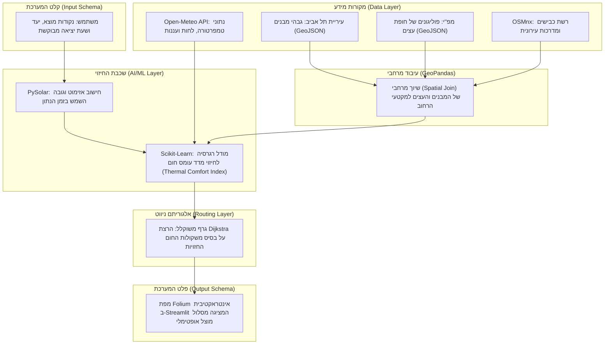

# SHADY — Thermal-Comfort Urban Routing System

> **One-Liner:** אופטימיזציה של תנועה עירונית להולכי רגל שמתעדפים צל באמצעות שכבות מידע גיאוגרפי ומאגרי מידע חינמיים ברשת.

---

## 1. The Problem


**אפליקציות ניווט מסחריות ממוקדות באופטימיזציה של זמן ומרחק בלבד**, תוך התעלמות מאפקט אי החום העירוני והיעדר הצללה, ההופכים רחובות למלכודות קרינה בקיץ הישראלי. עבור הולך הרגל הממוצע מדובר באי-נוחות, אך עבור אוכלוסיות רגישות ופגיעות — כגון רגישים לשמש, קשישים, ילדים והורים עם עגלות תינוק — **בחירה במסלול חשוף לשמש מהווה סכנה בריאותית מוחשית של מכות חום, עומס תרמי והתייבשות.**

למרות שנתוני תשתית קריטיים, כמו גבהי מבנים מדויקים וחופת העצים העירונית, זמינים כיום במאגרי מידע ציבוריים פתוחים (Open Data), הם נותרים מבוזרים, גולמיים ובלתי נגישים. כיום חסר פתרון טכנולוגי דינמי המבצע התכת נתונים (Data Fusion) בין שכבות ה-GIS הסטטיות לבין נתוני מזג אוויר וזווית השמש המשתנים, כדי לחשב נתיב הליכה אופטימלי המבוסס על **מדדי נוחות תרמית והצללה בזמן אמת.**

---

## 2. Vision & Goals — חזון ומטרות

**חזון:**
עיר הניתנת להליכה בכל שעה — גם בשיא הקיץ הישראלי. אנחנו מאמינות שניווט מודע-צל הוא זכות בסיסית, לא מותרות טכנולוגית.

**מטרות הפרויקט:**
1. **נגישות לאוכלוסיות פגיעות** — להעניק לקשישים, ילדים, הורים עם עגלות ואנשים עם רגישות לשמש כלי ניווט שלא קיים היום.
2. **Open Data כפתרון בריאות ציבורית** — להדגים שמאגרי נתונים ממשלתיים פתוחים (עיריית ת"א, מפ"י, OSM) מספיקים לפתרון בעיות אמיתיות — ללא סנסורים יקרים.
3. **מדע ניתן להרחבה** — לבנות ארכיטקטורה שניתן להעתיק לחיפה, ירושלים ושאר ערי ישראל עם שינוי מינימלי בנתונים.

---

## 3. Target Audience


**פרסונה (Persona) אחד מוגדר:**
נועה, בת 28, עובדת הייטק, לבקנית, שנוהגת להגיע ברכבת לתחנת השלום בתל אביב וצועדת ברגל כ-20 דקות למשרד שלה בשדרות רוטשילד. בתור בחורה צעירה שגרה במרכז, אין לה רכב והיא אוהבת לשלב הליכות בשגרת היום שלה. 

**תרחיש קונקרטי (Use Case):**
 באמצע אוגוסט בשעה 13:00, נועה צריכה לנסוע אל העבודה לאחר סידורי הבוקר שלה. כמו הרבה צעירים בתל אביב, נועה סובלת מיוקר המחייה ומעדיפה לא לעמוד בפקקים בתחבורה ציבורית במחיר מופקע אם היא יכולה ללכת ולשמור על אורח חיים בריא. ניווט רגיל ייקח אותה דרך מדרכות חשופות לחלוטין לשמש, והיא תגיע למשרד מיוזעת ותשושה. בעזרת SHADY, היא מזינה את היעד ומקבלת מסלול שאולי ארוך ב-3 דקות, אך עובר ברחובות בעלי חופת עצים עשירה ובצל המבנים, מה ששומר על בריאותה ונוחותה.


---

## 4. Data Card


פרויקט Shady מתבסס על היתוך מאגרי מידע פתוחים ברישיונות ציבוריים וממשלתיים:

**שכבת מבני עיריית ת"א (https://opendata.tel-aviv.gov.il):** 
* **פורמט וגודל:** קובץ GeoJSON המכיל כ-45,900 ישויות וקטוריות (פוליגונים).
* **רישיון:** רישיון מידע פתוח חופשי של עיריית תל-אביב-יפו.
* **שדות עיקריים:** `gova_simplex_2019` (גובה מבנה נטו במטרים), `ms_komot` (מספר קומות) ו-`geometry`.
* **חוסרים ידועים:** ערכי NaN (מידע חסר) עבור כ-4% מגבהי המבנים. חוסר זה מטופל ומנובא אקטיבית כבר עכשיו על ידי מודל ה-Machine Learning (על בסיס שטח המבנה והסנטרואיד שלו), ללא כל הסתמכות על איסוף נתונים עתידי.

**שכבת חופת עצים לאומית — מפ"י (https://data.gov.il/dataset/nationalcanopytrees):**
* **פורמט וגודל:** קובץ GeoJSON מסונן המכיל כ-231,000 פוליגונים של חופות עצים ייעודיות באזור תל אביב.
* **רישיון:** רישיון הממשלה לשימוש במידע חופשי (data.gov.il).
* **שדות עיקריים:** `geometry` (מגדיר את פוליגון חופת העץ לחישוב שטח הצללה ואידוי-דיות להורדת טמפרטורה).
* **חוסרים ידועים:** חוסר נקודתי ברמת הרחוב במקומות בהם קיימת הסתרה של צמחייה עקב בנייה רוויה בתצלומי האוויר.

**רשת רחובות — OpenStreetMap (https://osmnx.readthedocs.io/):**
* **פורמט וגודל:** אובייקט גרף מתמטי (Network Graph) המכיל את כלל צמתי ומקטעי הרחובות בתל אביב.
* **רישיון:** רישיון בסיס נתונים פתוח (ODbL).
* **שדות עיקריים:** `geometry`, `length` (אורך מקטע במטרים), ו-`highway` (סיווג סוג הדרך).

**נתוני אקלים — Open-Meteo API (https://open-meteo.com/):**
* **פורמט וגודל:** קובץ JSON דינמי המזרים נתונים אקלימיים ברזולוציה שעתית.
* **רישיון:** רישיון חופשי לשימוש לא מסחרי (CC-BY 4.0).
* **שדות עיקריים:** `temperature_2m`, `relative_humidity_2m` ו-`cloud_cover` (אחוז עננות בזמן אמת).

**הטיות אפשריות ופערים (Biases & Limitations):** המאגרים הסטטיים (עירייה ומפ"י) סובלים מהטיית פער זמנים מרחבי (Temporal Mismatch). הנתונים משקפים את המצב בשטח למועד המיפוי האחרון של הרשויות ואינם כוללים שינויים ארכיטקטוניים או בוטניים מיידיים (בניינים חדשים, מבנים שנהרסו בפינוי-בינוי, או עצים שנכרתו/נשתלו לאחרונה).

---

## 5. ML Problem Formulation

**הגדרת הבעיה:** מודל רגרסיה לחיזוי **מדד עומס החום המורגש (Thermal Comfort Index)** של מקטע רחוב.

**קלט** $X$ — וקטור של **7 מאפיינים** מרחביים ואקלימיים לכל מקטע רחוב (edge):

| קבוצה | תכונה | תיאור |
|-------|--------|-------|
| פיזית-סטטית | `building_height` | ממוצע גובה מבנים סביב המקטע (נקרא `mean_building_height` ב-edges_features) |
| פיזית-סטטית | `canopy_ratio` | אחוז כיסוי חופת העצים סביב המקטע (נקרא `tree_canopy_ratio` ב-edges_features) |
| פיזית-סטטית | `azimuth` | כיוון הרחוב (מעלות) — דקוי בנוסחה האנליטית הנוכחית |
| דינמית | `sun_altitude` | גובה השמש ברגע הנתון (PySolar) |
| דינמית | `temperature`, `humidity` | טמפרטורה ולחות (Open-Meteo) — פרוקסי ל-`cloud_cover` |
| דינמית | `cloud_cover` | אחוז עננות (Open-Meteo) |

> הערה: אין `sun_azimuth` במימוש הנוכחי. אזימוט השמש הוא שיפור עתידי (ראו WORKLOG / CLAUDE.md).

**פלט** — ערך רציף סינתטי המייצג את מדד עומס החום המורגש במקטע: $y \in [1, 10]$ (מחושב עבור נתוני האימון באמצעות נוסחה תרמית אנליטית מבוססת קרינה ואינדקס חום).

**Loss function:**

$$\mathcal{L} = \text{MSE} = \frac{1}{n}\sum_{i=1}^{n}(y_i - \hat{y}_i)^2$$

**מטריקת הצלחה:** $\text{RMSE} = \sqrt{\mathcal{L}}$

> **הגדרת KPI:** המודל שלנו הוא מודל רגרסיה ונשתמש ב-RMSE כי משתנה היעד ($TCI$) הוא מספר רציף (1–10), והמדד מעניש בחומרה טעויות חיזוי גדולות (בריבוע) — מה שמבטיח בטיחות להולכי הרגל ומונע שליחתם לרחוב לוהט שנחזה בטעות כמוצל.

**ניתוח בחירת KPI — 3 שלבים:**
1. **מה הפלט?** רגרסיה — TCI הוא מספר רציף, לא קטגוריה.
2. **מה עלות הטעות?** טעות גדולה = סיכון בטיחותי לאוכלוסיות פגיעות (קשישים, לבקנים, ילדים). RMSE מעלה טעויות בריבוע ומכריח את המודל להיות שמרן.
3. **איך נראה משתנה היעד?** מתפרש על פני כל הטווח — RMSE נותן אינדיקציה אמיתית על איכות החיזוי, בניגוד למדדי סיווג שהיו מאבדים את הרזולוציה הרציפה.

**חלוקת דאטה (בפועל ב-M3):** 80% train / 20% test, `random_state=42`, פיצול לפי שורה (לא לפי רחוב) — כך שכל קבוצה מכילה מקטעים בשעות יממה שונות. מתאים למקרה השימוש (ניווט ברשת ידועה), אך לא בודק הכללה לרחובות חדשים.

**Baseline:** 

ה-baseline למודל ה-ML הוא `DummyRegressor(strategy="mean")` — תמיד מנבא את ממוצע ה-TCI (RMSE≈1.77 על test). כל מודל אמיתי חייב לנצח אותו. (Linear Regression / Decision Tree / Random Forest הם **מודלים מועמדים**, לא baseline.) יעילות הניווט הכללית תושווה בנפרד מול אלגוריתם $\text{Dijkstra}$ גיאומטרי.

**M3 — מה מומש בפועל (ושיפורים עתידיים):**

| שלב | מומש ב-M3 | שיפור עתידי |
|-----|-----------|-------------|
| חלוקת דאטה | פיצול **לפי שורה**, 80/20, `random_state=42` | Spatial Split (לפי מקטע) להכללה לרחובות חדשים |
| Baseline | **`DummyRegressor(mean)`** (RMSE≈1.77) — כל מודל חייב לנצח | — |
| מודלים | Linear / Decision Tree / **Random Forest** (מנצח, RMSE 0.12) | XGBoost / LightGBM |
| Feature Engineering | 7 פיצ'רים מ-`build_tci_df` | Log-transform ל-canopy; `bearing × sun_azimuth` לזווית צל |

---

## 6. Architecture




**תיאור זרימה:**
1. **Frontend & UI (Streamlit & Folium):** ממשק לקליטת נתוני המשתמש (זמן ומרחב) והצגת הפלט הוויזואלי הסופי.
2. **Dynamic Environmental Data:**  פנייה ל-API של Open-Meteo לשליפת מזג האוויר ואינטגרציה עם PySolar לחישוב מיקום השמש האסטרונומי.
3. **Spatial Processing Layer (GeoPandas):**  הלבשת שכבות ה-GIS הסטטיות (מבני העירייה וחופת העצים של מפ"י) על גבי גרף הרחובות הטופולוגי שנשלף מ-OSMnx.
4. **Machine Learning Model (Scikit-Learn):** חישוב משקולת עומס חום מורגש (בין 1 ל-10) לכל קשת בגרף על בסיס הפיצ'רים הדינמיים והסטטיים.
5. **Graph Routing Algorithm (NetworkX / Dijkstra):**  מציאת המסלול בעל העלות התרמית הנמוכה ביותר והזרקתו חזרה למפת ה-Frontend.

---

## 7. User Stories

* כמשתמשת באפליקציה, אני רוצה שהמסלול המוצע ישתנה דינמית בהתאם לשעה ביום שאני בוחרת, מכיוון שזווית השמש משתנה ומיקום צל המבנים זז.
  * קריטריון קבלה: הזזת ה-Slider של השעה בממשק ה-Streamlit תפעיל מחדש את חישוב זווית השמש ב-PySolar, תעדכן את משקולות החיזוי של המודל, ותציג מסלול מעודכן על גבי המפה.

* כהורה המנווט במרחב העירוני עם עגלת תינוק (או כאדם בעל רגישות רפואית גבוהה לקרינת UV), אני רוצה לקבל בממשק חיווי ברור של אחוז ההצללה הכולל במסלול ואפשרות לבחור במצב "צל מקסימלי", כדי שאוכל למזער לחלוטין את החשיפה לשמש ישירה, גם במחיר של הארכת דרך קלה.
  * קריטריון קבלה: ממשק ה-Streamlit יציג לצד המפה מדד מספרי של אחוז ההצללה המשוער (למשל: "85% מהמסלול מוצל"), ויכלול כפתור סימון  (Toggle) שלוקח בחשבון העדפת צל קיצונית ומעדכן את משקולות הניווט בהתאם.

* כמשתמשת המבקשת לצאת לטיול רגלי או להליכה ספורטיבית בעיר בשעות אחר הצהריים, אני רוצה לראות את מפת הרחובות סביבי כשהיא צבועה בצבעים שונים לפי רמת עומס החום הנוכחית שלהם, כדי שאוכל לבחור לאן לפנות באופן עצמאי מבלי להגדיר יעד סופי קבוע מראש.
  * קריטריון קבלה: מפת ה-Folium באפליקציה תצבע את מקטעי הרחובות (Edges) בצבעים דינמיים משתנים (למשל: ירוק לעומס חום נמוך/נעים, אדום לעומס חום קיצוני/חשוף) בהתאם לציון ה-y שחוזה מודל ה-ML עבור השעה שנבחרה ב-Slider.
---

## 8. Related Work

פתרונות קיימים כוללים את אפליקציית הניווט המקומי Cool Walks Barcelona המציעה מסלולים מוצלים אך אינה שימושית בישראל, ואת פלטפורמת Shadowmap המציגה ויזואליזציית צל תלת-ממדית אינטראקטיבית בזמן אמת אך ללא אלגוריתם ניווט. בספרות האקדמית, מחקרי מיקרו-אקלים עירוני (כגון שימוש במדד הנוחות התרמית UTCI) מסתמכים לרוב על סימולציות כבדות (כמו כלי ENVI-met) שאינן ישימות לחישוב דינמי.

**השוני של Shady:** בניגוד אליהם, הפרויקט שלנו מתיך מאגרי מידע וקטוריים דו-ממדיים וקלילים (מבנים ועצים) עם מודל ML מהיר ונתוני אקלים משתנים, ומספק לראשונה פתרון בר-הרחבה (Scalable) לניווט מותאם עומס חום בזמן אמת בסביבת ייצור.

---

## 9. Risk Register

| # | סוג הסיכון | סיכון | חומרה | מיגור (Mitigation) |
| :--- | :--- | :--- | :--- | :--- |
| 1 | **טכני** | **API Downtime** — נפילה או Rate-limiting של Open-Meteo בזמן ריצת האפליקציה. | גבוהה | הגדרת Fallback קבוע בקוד: במקרה של שגיאת תקשורת, המערכת תמשוך אוטומטית נתוני אקלים ועננות ממוצעים עונתיים השמורים מקומית. |
| 2 | **נתונים** | **Spatial Mismatch** — חוסר התאמה גיאומטרי מובנה בין רשת הדרכים של OSM לשכבות ה-GIS של העירייה ומפ"י. | בינונית | ביצוע שיוך מרחבי מבוסס רדיוס השפעה (`Buffer-radius` של 5 מטרים) ב-GeoPandas, המבטיח הצלבה נכונה של המבנים והעצים לרחוב גם תחת סטיות מיפוי. |
| 3 | **לוח זמנים** | **Integration Bottleneck** — עיכוב בלוח הזמנים עקב מורכבות פיתוח מודל ה-ML במקביל לבניית ממשק הניווט הדינמי. | בינונית | עבודה במתודולוגיית MVP (מוצר מינימלי עובד): בניית גרף הניווט וממשק ה-Streamlit בשלב ראשון על בסיס נוסחה אנליטית פשוטה, ורק אז הלבשת מודל ה-ML כשיפור משלים. |

---

## 10. Installation

```bash
pip install -r requirements.txt
streamlit run app.py
```

---

## 11. M3 — Trained Model (How to Run)

**אימון המודל** (מתיקיית השורש של הפרויקט):
```bash
python -m src.model
```
הפקודה מאמנת baseline (`DummyRegressor`) + 3 מודלים מועמדים (Linear / Decision Tree / Random Forest), מדפיסה טבלת השוואה לפי RMSE ו-R² על קבוצת ה-test, בוחרת את המנצח, ושומרת אותו ל-`data/tci_model.joblib`.

**תוצאות (על test):**

| מודל | RMSE | R² |
|------|------|----|
| baseline (mean) | 1.77 | ~0 |
| Linear Regression | 0.40 | 0.95 |
| Decision Tree | 0.21 | 0.99 |
| **Random Forest** 🏆 | **0.12** | **0.995** |

**חיזוי חי באפליקציה:** טאב **📊 ניתוח נתונים** → **גרף 4 (מפת TCI)** → בוחרים "מודל ML" + גובה שמש. האפליקציה טוענת את `data/tci_model.joblib` (דרך `load_tci_model` עם `@st.cache_resource`) וחוזה TCI **לכל מקטע רחוב** באזור → מפה צבועה לפי החיזוי.

**טבלת ההשוואה וההנמקה** מוצגות בתוך האפליקציה בטאב **ℹ️ אודות** → "🏆 M3 — תוצאות" (נטענות מ-`data/model_results.json` שנוצר ע"י `python -m src.model`).

> **מהימנות:** משתנה היעד (TCI) מחושב כרגע מנוסחה אנליטית (יעד סינתטי), ולכן ה-R² הגבוה משקף שהמודל משחזר את הנוסחה — צעד ביניים מתוכנן עד שיהיו תוויות אמת מדודות. אם הקובץ `data/tci_model.joblib` חסר, הריצו `python -m src.model` פעם אחת.

---
***SHADY - Stay Cool ;)***


*Alisa & Rony — LBS Course 160833, Technion*
